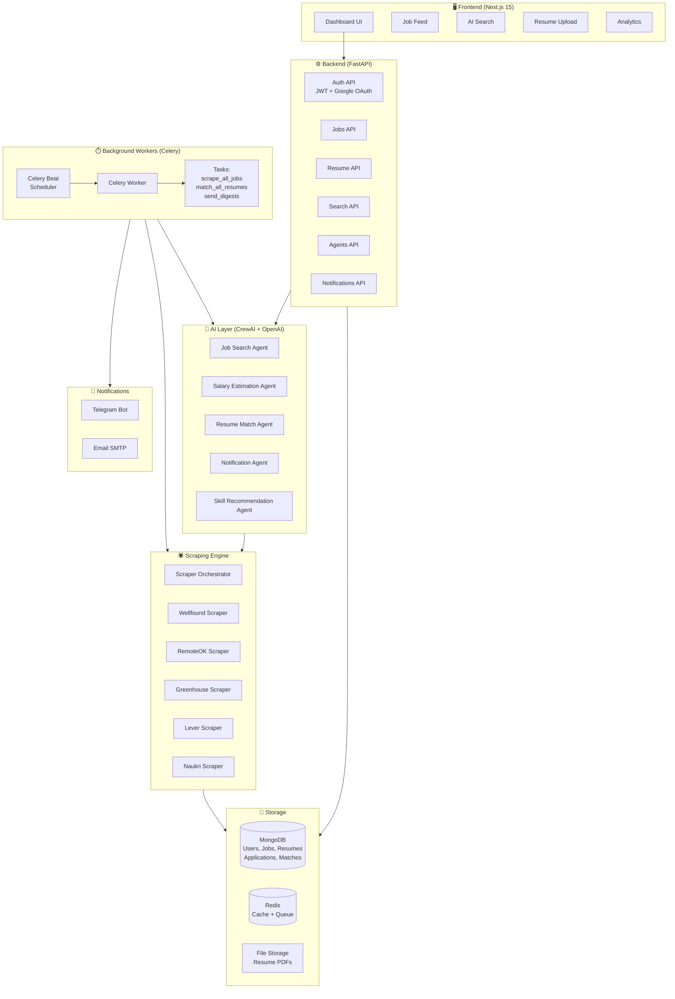

```mermaid
graph TB
    subgraph Frontend["🖥️ Frontend (Next.js 15)"]
        UI[Dashboard UI]
        JobFeed[Job Feed]
        Search[AI Search]
        Resume[Resume Upload]
        Analytics[Analytics]
    end

    subgraph Backend["⚙️ Backend (FastAPI)"]
        Auth[Auth API<br/>JWT + Google OAuth]
        JobsAPI[Jobs API]
        ResumeAPI[Resume API]
        SearchAPI[Search API]
        AgentsAPI[Agents API]
        NotifAPI[Notifications API]
    end

    subgraph AI["🤖 AI Layer (CrewAI + OpenAI)"]
        JSAgent[Job Search Agent]
        SalaryAgent[Salary Estimation Agent]
        MatchAgent[Resume Match Agent]
        NotifAgent[Notification Agent]
        SkillAgent[Skill Recommendation Agent]
    end

    subgraph Scraping["🕷️ Scraping Engine"]
        Orchestrator[Scraper Orchestrator]
        WF[Wellfound Scraper]
        ROK[RemoteOK Scraper]
        GH[Greenhouse Scraper]
        LV[Lever Scraper]
        NK[Naukri Scraper]
    end

    subgraph Workers["⏱️ Background Workers (Celery)"]
        Beat[Celery Beat<br/>Scheduler]
        Worker[Celery Worker]
        Tasks[Tasks:<br/>scrape_all_jobs<br/>match_all_resumes<br/>send_digests]
    end

    subgraph Storage["💾 Storage"]
        MongoDB[(MongoDB<br/>Users, Jobs, Resumes<br/>Applications, Matches)]
        Redis[(Redis<br/>Cache + Queue)]
        Files[File Storage<br/>Resume PDFs]
    end

    subgraph Notifications["📨 Notifications"]
        Telegram[Telegram Bot]
        Email[Email SMTP]
    end

    UI --> Backend
    Backend --> Storage
    Backend --> AI
    AI --> Scraping
    Scraping --> Storage
    Workers --> Scraping
    Workers --> AI
    Workers --> Notifications
    Beat --> Worker
    Worker --> Tasks
```
